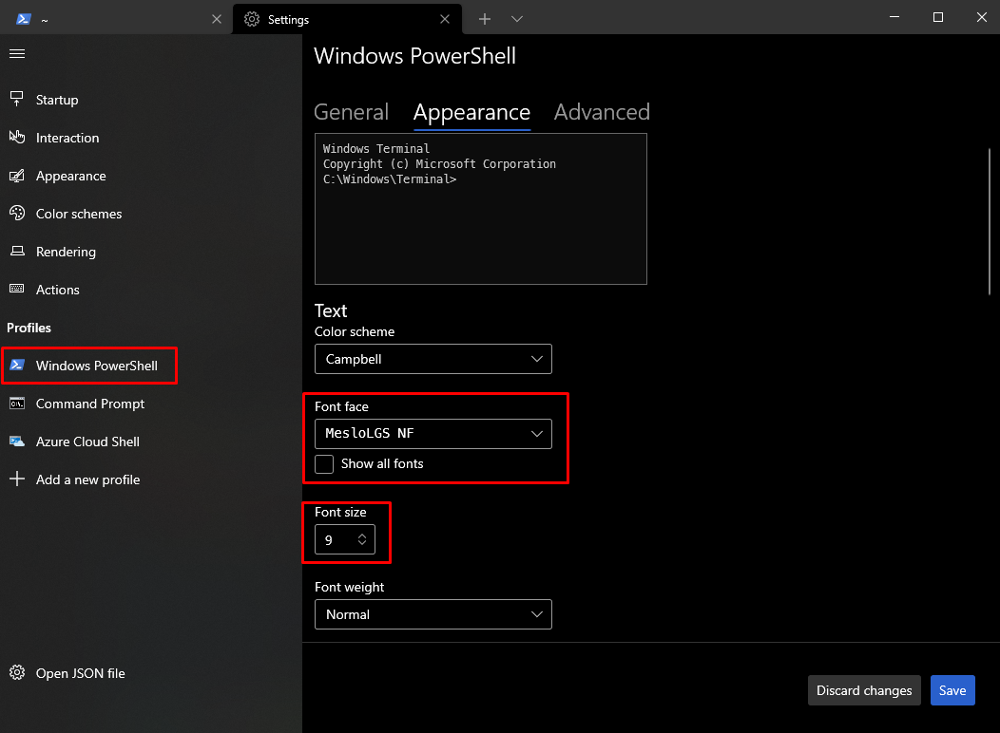

# Windows configuration

> :information: **INFO**
> 
> Most of the steps described bellow can execute automatically using the **[magic-configurator.ps1](https://github.com/smyrnakis/DevEnv-configuration/tree/master/Windows/magic-configurator/)** script.

<br>

# choco

Install <a href="https://chocolatey.org/install" target="_blank">chocolatey</a> software manager.

In an *Administrator* PowerShell session type:

``` ps1
Set-ExecutionPolicy Bypass -Scope Process -Force; [System.Net.ServicePointManager]::SecurityProtocol = [System.Net.ServicePointManager]::SecurityProtocol -bor 3072; iex ((New-Object System.Net.WebClient).DownloadString('https://community.chocolatey.org/install.ps1'))
```

<br>

# Terminal

## cmder

Install <a href="https://cmder.net/" target="_blank">cmder</a> using *choco*:

``` ps1
choco install cmder
```

### Keyboard shortcuts

#### Tab manipulation

`Win + Alt + p` : Preferences (Or right click on title bar)

`Ctrl + t` : New tab dialogue (maybe you want to open cmd as admin?)

`Ctrl + w` : Close tab

`Shift + Alt + number` : Fast new tab:
1. CMD
2. PowerShell

`Alt + Enter` : Fullscreen

#### Shell

`Ctrl + Alt + u` : Traverse up in directory structure (lovely feature!)

`End, Home, Ctrl` : Traverse text as usual on Windows

`Ctrl + r` : History search

`Shift + mouse` : Select and copy text from buffer

`Right click / Ctrl + Shift + v` : Paste text 

<br>

## ConEmu & Windows Terminal

``` ps1
choco install ConEmu
choco install microsoft-windows-terminal
```

<br>

### Fonts

Download and install **Meslo** font <a href="https://github.com/romkatv/powerlevel10k/blob/master/font.md" target="_blank">here</a>.

*(alternative: <a href="https://github.com/ryanoasis/nerd-fonts" target="_blank">https://github.com/ryanoasis/nerd-fonts</a>)*

### Configure Powershell

Check if the `$profile` exist.

``` ps1
Test-Path $profile
```

If not (`False`), create it using the command:

``` ps1
New-Item -path $profile -type file –force
```

<br>

> Before moving forward you might need to allow the execution of PowerShell scripts.
> 
> To do so, execute `Set-ExecutionPolicy -ExecutionPolicy Unrestricted`
> 
> It is recommended to restore the ExecutionPolicy in `Restricted` after you finish installing the tools!
> 
> More info <a href="https://docs.microsoft.com/en-us/powershell/module/microsoft.powershell.core/about/about_execution_policies?view=powershell-7.1" target="_blank">about_Execution_Policies</a>

<br>

Installation of <a href="https://dahlbyk.github.io/posh-git/" target="_blank">posh-git</a> and <a href="https://pecigonzalo.github.io/Oh-My-Posh/" target="_blank">oh-my-posh</a>.

``` ps1
Install-Module posh-git -Scope CurrentUser
Install-Module oh-my-posh -Scope CurrentUser
```

``` ps1
Set-PoshPrompt
Set-PoshPrompt -Theme iterm2
```

To see the available list of themes, type:

``` ps1
Get-PoshThemes
```

To add icons next to items in `ls` command execute the following in an **elevated** prompt:

``` ps1
Install-Module -Name Terminal-Icons -Repository PSGallery  
```

<br>

Edit the PowerShell profile (usually in `~\Documents\WindowsPowerShell\Microsoft.PowerShell_profile.ps1`) and add the following:

<a href="https://github.com/smyrnakis/DevEnv-configuration/blob/master/Windows/WindowsPowerShell/Microsoft.PowerShell_profile.ps1" target="_blank">Microsoft.PowerShell_profile.ps1</a>

Reload the `$profile` using the command:

``` ps1
. $profile
```

<!-- To set the branch symbol, use:
``` ps1
$ThemeSettings.GitSymbols.BranchSymbol = [char]::ConvertFromUtf32(0xE0A0)
``` -->

<!-- Hide your `username@domain` when not in a virtual machine for the Agnoster, Fish, Honukai, Paradox and Sorin themes:
``` ps1
$DefaultUser = 'username'
``` -->

#### Configure Font

In **Windows Terminal**, go to *Settings* and click on *Windows PowerShell* under *Profiles*.

On *Font face* select the `Meslo` font. For *Font size* select `9`.



<br>

In **PowerShell** go to *Properties* --> *Font*.

Select the `Menslo` and click on **OK**.

<br>

# VIM

## Installation

In an **elevated** prompt, execute:

``` ps1
choco install vim
```

## Cheatsheet

`w`: next word<br>
`b`: previous word<br>
`gg`: go to the top of the file<br>
`V`: visual mode<br>
`G`: go to the bottom of the file<br>
`ggVG`: select all<br>
`:%d`: delete every line<br>
`=G`: fix indentation in all document (only if cursor is moved on top)<br>
`S`: start writing on a line at correct indentation<br>
`>` `<`: indent/unindent multiple lines (in visual line mode)<br>
`>>` `<<`: indent/unindent a line<br>
`:tabnew` creates a new tab<br>
`gt` go to next tab<br>
`gT` go to previous tab<br>
`:tabo` close all other tabs besides the active one<br><br>

`:setlocal spell` enable spell check
`:set nospell` disable spell check

* https://www.freecodecamp.org/news/7-vim-tips-that-changed-my-life/

## Plugins

* [vim-plug](https://github.com/junegunn/vim-plug) plugin manager
* [https://vimawesome.com/](https://vimawesome.com/) collection of Vim plugins
* [vim-fugitive](https://github.com/tpope/vim-fugitive) git plugin for Vim
* [auto-pairs](https://github.com/jiangmiao/auto-pairs) insert or delete brackets, parens, quotes in pair
* https://vimawesome.com/

<br>

# GIT

## Installation

In an **elevated** prompt, execute:

``` ps1
choco install git.install
```

## Configure user

``` ps1
git config --global user.name "<YOUR-NAME>"
git config --global user.email "<YOUR-EMAIL>"
```

## Aliases
``` ps1
git config --global alias.st 'status'
git config --global alias.lga 'log --all --decorate --oneline --graph'
git config --global alias.lg 'log --decorate --oneline --graph'
git config --global alias.lgg "log --color --graph --pretty=format:'%Cred%h%Creset -%C(yellow)%d%Creset %s %Cgreen(%cr) %C(bold blue)<%an>%Creset' --abbrev-commit --branches"
git config --global alias.pom 'push origin master'
git config --global alias.poma 'push origin main'
git config --global alias.poh 'push origin $(git rev-parse --abbrev-ref HEAD)'
git config --global alias.amn 'commit --amend --no-edit'
git config --global alias.am 'commit --amend'
git config --global alias.ca 'commit -am'
git config --global alias.cm 'commit -m'
```

## SSH keys

> Related articles	
>  
>  [Generate & add key to the SSH agent](https://docs.github.com/en/authentication/connecting-to-github-with-ssh/generating-a-new-ssh-key-and-adding-it-to-the-ssh-agent#)
>  
>  [Add SSH key to Github](https://docs.github.com/en/authentication/connecting-to-github-with-ssh/adding-a-new-ssh-key-to-your-github-account)

<br>

### Create the SSH key

Open **Git Bash** terminal and type:

``` ps1
ssh-keygen -t rsa -b 4096 -C "id_github"
```

When asked where to save the file, chose the directory and the name.

``` git
Enter file in which to save the key (/c/Users/{YOUR-USERNAME}/.ssh/id_rsa): /c/Users/{YOUR-USERNAME}/.ssh/id_github
```

### Add SSH key in SSH agent

``` ps1
eval "$(ssh-agent -s)"

ssh-add ~/.ssh/id_github
```

### Add SSH key in Github

``` ps1
clip < ~/.ssh/id_github.pub
```

Go to Github *Settings --> SSH and GPG keys --> New SSH key* and paste the public key. Add a *title* and save it.

**NOTE:** you might need to enable Windows SSH service and add the SSH keys. Instructions here: [Windows OpenSSH service](https://github.com/smyrnakis/DevEnv-configuration/tree/master/Windows#windows-openssh-service).

<br>

### Multiple Git accounts & SSH keys

Follow the steps bellow in order to be able to use simultaneously a Github and a Gitlab account on the same PC.

Create all the needed SSH keys as explained in [Create the SSH key](https://github.com/smyrnakis/DevEnv-configuration/tree/master/Windows#create-the-ssh-key) and give them different names.

Add your keys to the appropriate online account (github, gitlab etc) as explained in [Add SSH key in Github](https://github.com/smyrnakis/DevEnv-configuration/tree/master/Windows#add-ssh-key-in-github).

<br>

Create the `config` file under `~\.ssh` directory (if it doesn't exist already):

``` ps1
cd ~\.ssh
Out-File -FilePath config -Encoding utf8 -Force -NoNewline -NoClobber
```

``` ps1
vim ~\.ssh\config
```

Add the following content in your `config` file, changing the names when needed:

``` bash
# Personal GitHub.com
Host github.com
  PreferredAuthentications publickey
  IdentityFile ~/.ssh/id_github

# Professional GitLab
Host gitlab.com
  PreferredAuthentications publickey
  IdentityFile ~/.ssh/id_gitlab
```

<!-- ``` bash
Host github
	HostName github.com
	User git
	IdentityFile ~/.ssh/id_github
	IdentitiesOnly yes
Host gitlab
	Hostname gitlab.com
	User git
	IdentityFile ~/.ssh/id_gitlab
	IdentitiesOnly yes
``` -->

**NOTE:** be sure that the `config` file is saved *without* BOM. If you get issues with the authentication, open the file with *Notepad++* and select *Encoding* --> *UTF-8* and then save the file.

<!-- <br> -->

Next, edit the `~\.gitconfig` file. 

``` ps1
vim ~\.gitconfig
```

Remove any `[user]` block that might exist and add the following:

``` bash
[includeIf "gitdir:C:/Git/personal/"]
	path = .gitconfig_github
[includeIf "gitdir:C:/Git/professional/"]
	path = .gitconfig_gitlab
```

In the above example, we assume that Github is used for personal stuff and Gitlab for professional. We also assume the location of the personal Git folder to be `C:/Git/personal/` and the professional `C:/Git/professional/`.

Next, create the `.gitconfig_github` and `.gitconfig_gitlab` files.

``` ps1
cd ~
Out-File -FilePath .gitconfig_github -Encoding utf8 -Force -NoNewline -NoClobber
Out-File -FilePath .gitconfig_gitlab -Encoding utf8 -Force -NoNewline -NoClobber
```

Edit them and add the `email` and `name` information. For our example, your *personal* email for Github and your *professional* email for Gitlab. The name should be the same! :p

``` bash
[user]
	email = <YOUR-EMAIL>
	name = <YOUR-NAME>
```

Replace your email & name accordingly.

<!-- <br> -->

### Windows `OpenSSH` service

On Windows, OpenSSH might not be enabled by default.

Click on **Start**, type `services.msc` and hit **Enter**.

Find the service named `OpenSSH Authentication Agent` and double click on it.

On the *Startup type* select **Automatic** and click on the **Start** button if the *Service status* is not "Running". Finally, click OK.

<!-- <br> -->

In an **elevated** prompt, execute:

``` ps1
cd ~\.ssh

ssh-add .\id_github
ssh-add .\id_gitlab
```

<!-- <br> -->

In order to test the SSH keys, open a prompt and navigate to your git folder. Try the following command on both the `personal` and `professional` subdirectories. If you see the message that you are *"successfully authenticated"* then it works fine.

``` ps1 
ssh -T git@github.com

# or

ssh -T git@gitlab.com
```

Possible outputs:
```
Welcome to GitLab, <USERNAME>!

Hi <USERNAME> You've successfully authenticated, but GitHub does not provide shell access.
```

<br>

# MS Visual Studio code

## Installation

In an **elevated** prompt, execute:

``` ps1
choco install vscode.install
```

<!-- ## Settings sync

1) Install the [Settings sync](https://marketplace.visualstudio.com/items?itemName=Shan.code-settings-sync) plugin.
2) Use the gist ID `508d76ad7d54c9a1b6cbc3c1c71e7343`
https://gist.github.com/smyrnakis/508d76ad7d54c9a1b6cbc3c1c71e7343
3) Configure `syncLocalSettings.json` file to use same `keybindings.json` across all operating systems:

``` json
"universalKeybindings": true,
```

Location of `syncLocalSettings.json`:

* Windows: `%APPDATA%\Code\User\`
* macOS: `$HOME/Library/Application Support/Code/User/`
* Linux: `$HOME/.config/Code/User/`

Manual upload/download of settings:

* `Shift + Alt + U` : upload settings
* `Shift + Alt + D` : download settings

*Restarts of VS Code will be needed for the initial synchronisation!* -->

## List of custom shortcuts

* `Ctrl + Alt + t` : toggle panel
* `Ctrl + Alt + n` : new terminal in current script's location
* `Ctrl + Alt + c` : change terminal's directory to current script's location

<br>

# Notepad++

## Installation

In an **elevated** prompt, execute:

``` ps1
choco install notepadplusplus.install
```

<br>

# Atom

## Installation

In an **elevated** prompt, execute:

``` ps1
choco install atom --pre 
```

<br>

# Python

## Installation

In an **elevated** prompt, execute:

``` ps1
choco install python --pre
```

<br>

# MobaXterm

## Installation

In an **elevated** prompt, execute:

``` ps1
choco install mobaxterm
```

<br>

# WinSCP

## Installation

In an **elevated** prompt, execute:

``` ps1
choco install winscp.install
```

<br>

## Bibliography

* https://github.com/JanDeDobbeleer/oh-my-posh
* https://gist.github.com/JanDeDobbeleer/71c9f1361a562f337b855b75d7bbfd28
* https://dejanstojanovic.net/powershell/2021/june/customizing-powershell-with-oh-my-posh-v3/
* https://github.com/ohmyzsh/ohmyzsh
* https://medium.com/swlh/power-up-your-terminal-using-oh-my-zsh-iterm2-c5a03f73a9fb
* https://medium.com/ayuth/iterm2-zsh-oh-my-zsh-the-most-power-full-of-terminal-on-macos-bdb2823fb04c
* https://dahlbyk.github.io/posh-git/
* https://pecigonzalo.github.io/Oh-My-Posh/
* [Multiple repository and identities git configuration](https://gist.github.com/bgauduch/06a8c4ec2fec8fef6354afe94358c89e)